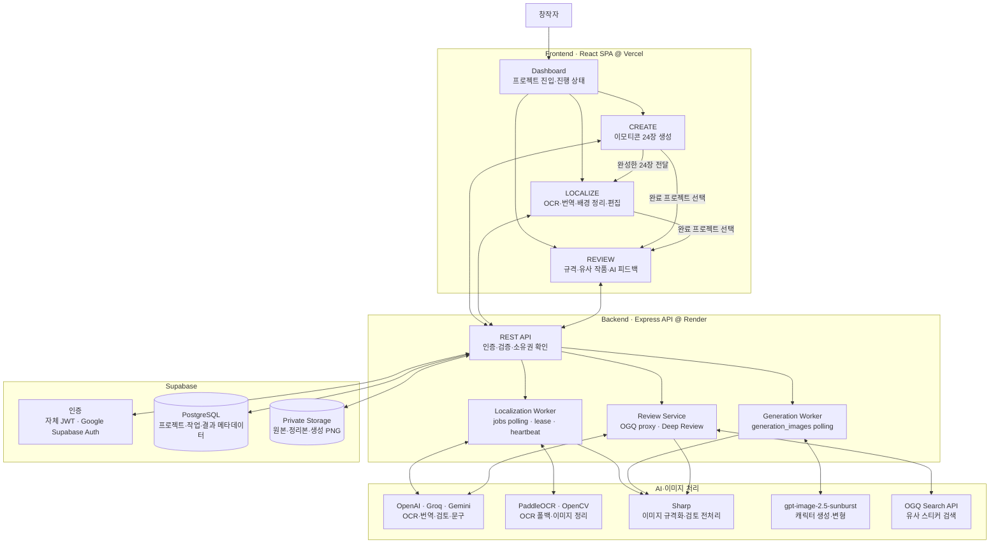
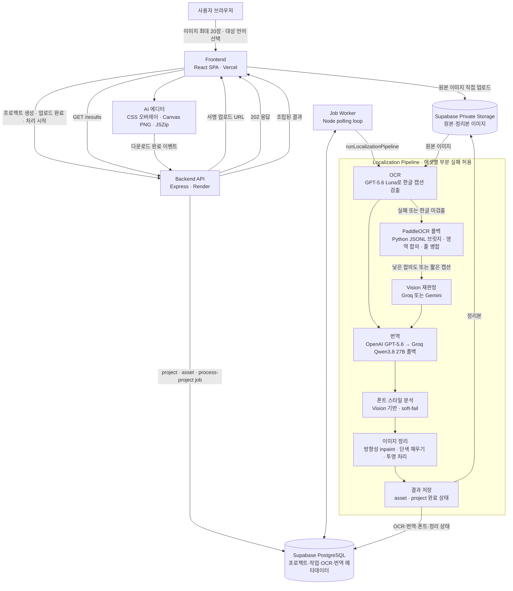
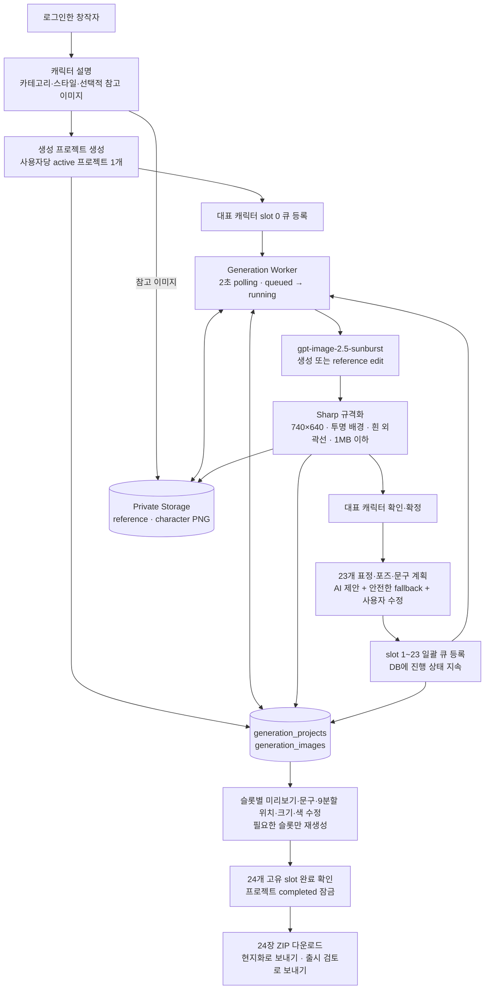
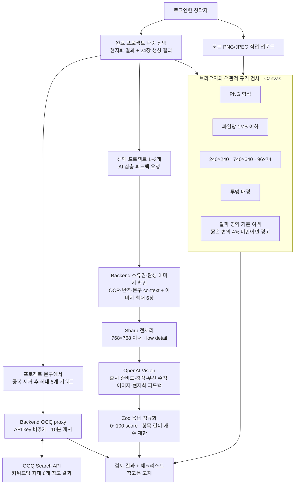

# **NAVER OGQ PROJECT**


### [Glocalizer]

Global + Localizer = 가장 로컬적인 것을 가장 글로벌하게 만들어주는 도구

#### **[배경]**

K-웹툰과 캐릭터 중심의 K-콘텐츠가 글로벌 시장에서 급격히 성장함에 따라, 국내 1인 창작자들의 해외 플랫폼 진출 수요와 마켓 성장 기회가 그 어느 때보다 확대되고 있는 사회적 흐름

#### **[문제점]**

**문화적 번역의 장벽**: 한국어 이모티콘의 핵심은 찰진 대사이지만, 이를 기존 번역기로 직역하면 딱딱하고 어색한 표현이 되어 이모티콘 특유의 맛과 감성이 현저히 떨어짐. 해외 마켓에 맞춘 유행이나 슬랭으로 번역하기엔 정보가 턱없이 부족하다는 것이 큰 문제임.

**번거로운 그래픽 수정 작업**: 글씨를 외국어로 바꾸려면 원래 이모티콘 이미지에서 한국어를 지우고, 비어버린 배경을 일일이 포토샵으로 메꾼 뒤, 새로운 글씨를 얹어야 하므로 디자이너가 없는 1인 작가나 소규모 팀에게는 이모티콘 레이어를 수정하는 작업은 시간 낭비이자 진입 장벽임.

---

#### **[해결 방안 (**Glocalizer**의 가치)]**

본 프로덕트는 사용자가 이모티콘 이미지를 업로드하면 이미지 속 한국어 글자 영역을 탐지하고, 안전하게 지울 수 있는 영역은 주변 색상과 형태를 바탕으로 자동 정리함. 이후 LLM이 한국어 원문의 의미와 말투를 대상 언어에 맞는 표현으로 현지화하고, 원본 스타일에 가까운 글꼴 후보와 함께 편집 가능한 결과를 제공함. OCR·번역·이미지 정리는 입력에 따라 실패하거나 부정확할 수 있으므로, 사용자는 에디터에서 원문과 번역문, 글자 영역, 배경 정리 방식, 글꼴과 위치를 직접 검토하고 수정할 수 있음.

**핵심 기능**

- **자동 배경 정리 + 수동 보정**: OCR로 찾은 글자 영역을 안전하게 판단되면 자동으로 지우고, 위험하거나 복잡한 배경은 원본을 보존한 뒤 사각형·브러시 도구로 직접 정리할 수 있음
- **다국어 현지화(EN/JA/ZH)**: 원문의 존댓말·타이핑 감정 표현(ㅋㅋ/ㅠㅠ 등)까지 반영해 번역하고, 후보 3안 중 베스트를 추천
- **클라우드 작업 저장**: 로그인 후 진행 중인 프로젝트가 자동 저장돼 다른 기기·세션에서 이어서 작업할 수 있고, 완료된 프로젝트는 보관함에서 다시 열람 가능
- **이메일 · 네이버 · 구글 로그인**
- **OGQ 마켓 연동**: 랜딩페이지 예시 갤러리, 업로드 페이지 샘플 체험, 완료된 프로젝트의 유사 스티커 검색·출시 체크리스트("OGQ 출시 검토")
- **(실험적, 내부 전용) AI 캐릭터 생성**: 텍스트 설명과 선택적 참고 이미지로 오리지널 캐릭터의 대표 이미지 1장 + 표정 23종을 자동 생성해 OGQ용 24장 세트를 만드는 별도 기능

---

#### **[시스템 아키텍처 — 심사위원용]**

Glocalizer는 **CREATE(생성) → LOCALIZE(현지화) → REVIEW(출시 검토)**를 하나의 계정과 프로젝트 흐름으로 연결함. 생성 결과 24장은 ZIP으로 받을 수 있을 뿐 아니라 현지화 입력이나 출시 검토 대상으로 바로 넘길 수 있고, 현지화가 끝난 프로젝트도 다시 출시 검토에서 불러올 수 있음.

##### **[전체 서비스 구조]**



- **공통 저장 경계**: 원본·정리본·생성 이미지는 private Storage에 보관하고 서명 URL 또는 인증된 API를 통해 접근함. 프로젝트 소유권은 API에서 다시 확인함.
- **비동기 실행**: 현지화와 이미지 생성 모두 DB 작업 상태를 기준으로 worker가 처리하므로, 긴 AI 작업을 HTTP 요청 하나에 묶지 않음.
- **기능 간 연결**: CREATE 결과를 LOCALIZE와 REVIEW가 재사용하고, LOCALIZE 결과도 REVIEW가 불러와 같은 출시 준비 흐름을 이어감.
- **검토의 책임 범위**: REVIEW는 기술 규격과 참고 피드백을 제공하며, OGQ에 자동 제출하거나 실제 승인·저작권 적합성을 보장하지 않음.

##### **[1. 이모티콘 현지화 아키텍처]**



**텍스트 상세 흐름**

1. 사용자가 이미지 최대 20장과 대상 언어를 선택하면 Frontend가 프로젝트와 asset row를 만들고, Backend가 발급한 Supabase Storage 서명 URL로 원본을 직접 업로드함. 대용량 원본이 Backend를 한 번 더 통과하지 않음.
2. `POST /uploads/complete`가 업로드를 검증하고, `POST /process`는 job 테이블에 `process-project`를 등록한 뒤 즉시 `202`를 반환함.
3. 같은 Node 프로세스의 Job Worker가 `WORKER_POLL_INTERVAL_MS` 주기로 job을 polling하며 lease와 heartbeat로 중복 실행을 막고, `runLocalizationPipeline(projectId)`를 실행함.
4. OCR은 GPT-5.6 Luna로 이미지의 여러 한글 캡션과 줄바꿈을 한 번에 검출함. 실패하거나 한글을 찾지 못하면 별도 Python 프로세스의 PaddleOCR로 전환하고, 다중 변형 IoU·텍스트 유사도 합의와 `mergeWrappedLines` 병합을 수행함. 신뢰도가 낮은 짧은 캡션은 Groq/Gemini Vision으로 재판정함.
5. 각 OCR 영역은 OpenAI GPT-5.6으로 영어·일본어·중국어 번역 후보를 만들고, 실패 시 Groq Qwen3.8 27B로 폴백함. 번역 완료 후 원본 글자 crop을 기준으로 굵기·둥글기·손글씨 여부·격식 같은 폰트 스타일을 분석하며, 이 분석 실패는 전체 작업을 중단하지 않음.
6. Cleanup은 OCR 영역의 배경 복잡도와 마스크 안전성을 평가해 방향성 inpaint·단색 채우기·투명 처리 중 하나를 선택함. 안전하지 않거나 검수가 필요한 영역은 원본을 보존하고 에디터의 수동 정리 대상으로 표시함.
7. 원본·정리본은 private Storage에, OCR 영역·번역 후보·폰트 스타일·에디터 상태는 PostgreSQL에 저장함. 프로젝트 단위 오류 대신 애셋별 부분 실패를 허용해 정상 이미지 결과를 먼저 제공함.
8. AI 에디터는 `GET /results`로 결과를 받아 정리본 위에 번역문을 CSS로 실시간 합성함. 사용자는 폰트·굵기·색·위치를 고치고 Canvas로 PNG를 다시 만들거나 JSZip으로 여러 장을 내려받음. 실제 다운로드 완료 시 `download_events`에 변환 완주 이벤트를 비동기로 기록함.

핵심 설계 포인트: 번역·OCR·Cleanup 실패를 애셋별로 격리하고, 무거운 Python OCR을 별도 프로세스로 분리함. Job 테이블 기반 worker라 Redis/SQS 같은 별도 큐 인프라 없이도 재시작·중복 실행을 제어함.

##### **[2. 이모티콘 생성 아키텍처]**



**텍스트 상세 흐름**

1. 로그인한 사용자가 캐릭터 설명과 카테고리·스타일을 입력하고, 필요하면 PNG/JPEG/WebP 참고 이미지를 1장 첨부함. 브라우저가 긴 변 800px 이하 WebP로 축소하고, Backend가 다시 검증·정규화해 private Storage에 저장함.
2. `generation_projects`에 active 프로젝트를 만들고 slot `0`의 대표 캐릭터 작업을 `generation_images`에 `queued`로 등록함. 사용자마다 active 프로젝트는 하나만 허용해 중복 프로젝트와 예산 경합을 줄임.
3. Generation Worker가 가장 오래된 queued 작업을 원자적으로 `running`으로 점유함. slot 0은 사용자 참고 이미지가 있으면 image edit로, 없으면 새 이미지 생성으로 처리함. 이후 slot 1~23은 확정된 slot 0 PNG를 reference로 사용해 캐릭터 정체성·색상·비율을 유지함.
4. 생성 결과는 Sharp로 OGQ 스티커 규격인 740×640 투명 PNG로 정규화함. 캐릭터에 흰 외곽선을 만들고, 알파 채널과 1MB 상한을 검증한 뒤 Storage 경로·실제 비용·처리 시간을 DB에 저장함.
5. 대표 캐릭터를 확정해야 다음 단계로 갈 수 있음. 확정 후 AI가 23개 포즈와 짧은 한국어 문구 계획을 제안하며, 호출 실패 시에도 고정 fallback 계획을 제공함. 사용자는 생성 전에 각 포즈와 문구를 직접 수정할 수 있음.
6. 저장한 plan의 남은 slot을 한 요청으로 큐에 넣으며, 브라우저를 닫아도 서버 worker가 계속 처리함. 사용자별 일일 예산, 프로젝트당 최대 작업 수, 동일 slot 동시 실행, 확정 전 후 slot 규칙은 PostgreSQL RPC에서 트랜잭션으로 검사함.
7. 각 완성 이미지는 캐릭터의 알파 영역과 주요 색을 분석해 문구를 덜 가리는 위·아래 위치와 글자색을 자동 선택함. 사용자는 9분할 위치·크기·글자색·외곽선색·문구를 slot별로 고치고, 실패하거나 마음에 들지 않는 slot만 선택 재생성할 수 있음.
8. `complete_generation`은 queued/running 작업이 없고 slot 0~23이 모두 completed일 때만 프로젝트를 완료 상태로 잠금. 이후 24장 ZIP 다운로드, 현지화 입력 전송, 출시 검토 프로젝트 선택으로 이어짐. 유료 요청이 중단된 경우 비용 중복을 막기 위해 자동 재시도하지 않고 실패 상태로 남김.

핵심 설계 포인트: 대표 캐릭터를 먼저 확정한 뒤 나머지 23장을 같은 reference에서 파생해 일관성을 확보함. 큐·비용·완료 조건을 DB에서 함께 강제하고, PNG 원본과 문구 스타일을 분리 저장해 미리보기 수정과 최종 다운로드 합성을 일치시킴.

##### **[3. 이모티콘 출시 검토 아키텍처]**



**텍스트 상세 흐름**

1. REVIEW는 완료된 현지화 프로젝트와 완료 이미지가 24장인 생성 프로젝트를 함께 조회함. 사용자는 여러 프로젝트를 선택할 수 있고, 프로젝트가 없어도 완성 파일을 직접 올려 규격만 검사할 수 있음.
2. 현지화 프로젝트에서는 OCR 캡션, 생성 프로젝트에서는 캐릭터 prompt와 이미지 문구를 모아 중복을 제거하고 최대 5개 검색어를 만듦. 검색어마다 Backend의 `GET /ogq/stickers`가 OGQ Search API에서 최대 6개 유사 스티커를 조회함. OGQ API key는 서버에만 두고 동일 요청은 10분간 캐시함.
3. 선택한 프로젝트 이미지는 하나씩 `fetch → Blob → File`로 바꿔 브라우저 Canvas 검사에 전달함. `Promise.allSettled`를 사용해 이미지 하나를 불러오지 못해도 나머지 검사를 계속함.
4. 객관적 검사는 PNG 여부, 파일당 1MB 이하, 공식 용도별 크기(메인 240×240, 스티커 740×640, 탭 96×74), 실제 알파 투명도, 캐릭터 주변 여백을 픽셀 단위로 확인함. 불투명 이미지처럼 여백을 분리할 수 없는 경우는 실패가 아니라 측정 불가 경고로 표시함.
5. 선택한 프로젝트가 1~3개이면 인증·시간당 rate limit이 적용된 `POST /review/deep-feedback`으로 심층 피드백을 요청할 수 있음. Backend는 프로젝트 소유권과 이용 가능한 완성 이미지를 확인하고, 구조화된 OCR·번역·Cleanup·생성 문구 context와 이미지 최대 6장을 준비함.
6. 이미지는 Sharp로 768×768 이내 PNG로 줄여 Vision 입력 비용과 크기를 제한함. AI는 작은 화면 가독성, 표정과 문구의 일치, 세트의 시각적 일관성, 번역 자연스러움, 명확한 출시 위험을 분석함. 결과는 Zod로 점수와 항목 개수·길이를 정규화해 UI에 표시함.
7. 마지막에는 사람이 확인할 출시 체크리스트와 참고용 고지를 함께 제공함. 이 기능은 출시 전 위험을 빠르게 찾는 보조 도구이며, OGQ 자동 제출·승인 판정·저작권 판정을 수행하지 않음.

핵심 설계 포인트: 비용 없는 객관적 Canvas 검사, 외부 OGQ 유사 사례 탐색, 선택적 AI 정성 피드백을 분리함. 한 단계가 실패해도 가능한 결과는 계속 보여주며, 외부 플랫폼의 실제 심사를 대신한다고 과장하지 않음.

##### **[아키텍처 코드 근거]**

| 흐름 | Frontend | Backend·Worker | DB·저장소 |
| --- | --- | --- | --- |
| 이모티콘 현지화 | [`Localize.tsx`](frontend/src/pages/Localize.tsx), [`Editor.tsx`](frontend/src/pages/Editor.tsx), [`uploads.tsx`](frontend/src/store/uploads.tsx) | [`processing.service.ts`](backend/src/services/processing.service.ts), [`worker.ts`](backend/src/workers/worker.ts), [`process-project.job.ts`](backend/src/workers/process-project.job.ts), [`ocr-pipeline.service.ts`](backend/src/ocr/ocr-pipeline.service.ts) | `projects`, `assets`, `jobs`, `ocr_regions`, `translations`, `editor_states`, `download_events`, private Storage |
| 이모티콘 생성 | [`Generate.tsx`](frontend/src/pages/Generate.tsx), [`generationApi.ts`](frontend/src/lib/generationApi.ts) | [`generation.routes.ts`](backend/src/routes/generation.routes.ts), [`generation.service.ts`](backend/src/services/generation.service.ts), [`generation-worker.ts`](backend/src/workers/generation-worker.ts) | `generation_projects`, `generation_images`, PostgreSQL enqueue/confirm/complete RPC, private Storage |
| 이모티콘 출시 검토 | [`Review.tsx`](frontend/src/pages/Review.tsx), [`OgqSpecChecker.tsx`](frontend/src/components/OgqSpecChecker.tsx), [`ogqSpecCheck.ts`](frontend/src/lib/ogqSpecCheck.ts) | [`ogq.service.ts`](backend/src/services/ogq.service.ts), [`deep-review.service.ts`](backend/src/services/deep-review.service.ts) | 기존 완료 프로젝트를 읽기 전용으로 조합하며 별도 승인 상태를 저장하지 않음 |

---

#### **[핵심 기능 검증 가이드 — 심사위원용]**

(https://app.notion.com/p/veyrix/Glocalizer-398ac3df7c3980748ab4f1648e46c742?source=copy_link) <- 심사위원용 실행 노션 페이지

**1. OCR 예외 처리**

다양한 이미지에서 한글 텍스트를 놓치거나 잘못 잘라내는 문제를 두 층위로 방어함.

| 방어 대상 | 구현 위치 | 관련 PR / 테스트 |
| --- | --- | --- |
| 한 캡션이 여러 줄로 잘려 인식되는 경우 | [`backend/src/ocr/merge-recognized-regions.ts`](https://github.com/Linkshimcat/Glocalizer/blob/main/backend/src/ocr/merge-recognized-regions.ts) — `belongsToNextLine` / `mergeWrappedLines`가 세로 간격·가로 겹침을 계산해 같은 캡션의 줄바꿈 조각을 하나로 병합 | [#24](https://github.com/Linkshimcat/Glocalizer/pull/24), [`merge-recognized-regions.test.ts`](https://github.com/Linkshimcat/Glocalizer/blob/main/backend/tests/unit/merge-recognized-regions.test.ts) |
| 한 이미지에 서로 다른 캡션이 여러 개인 경우 | [`backend/src/ocr/luna/luna-ocr.provider.ts`](https://github.com/Linkshimcat/Glocalizer/blob/main/backend/src/ocr/luna/luna-ocr.provider.ts) — 모든 캡션을 개별 영역(`regions[]`)으로 반환하도록 프롬프트 설계 | [#29](https://github.com/Linkshimcat/Glocalizer/pull/29) |
| OCR provider 자체가 실패(타임아웃/인증/요금 한도 등)하거나 한글을 못 찾은 경우 | [`backend/src/ocr/ocr-pipeline.service.ts`](https://github.com/Linkshimcat/Glocalizer/blob/main/backend/src/ocr/ocr-pipeline.service.ts) — 주력 provider(GPT-5.6 Luna) 실패 시 `getOcrFallbackProvider()`가 로컬 PaddleOCR로 자동 대체, 이미지 자체 처리 실패 시에도 다른 애셋 처리는 계속 진행 | [#29](https://github.com/Linkshimcat/Glocalizer/pull/29), [`luna-ocr.provider.test.ts`](https://github.com/Linkshimcat/Glocalizer/blob/main/backend/tests/unit/luna-ocr.provider.test.ts) |

정확도 근거: PIL로 픽셀 단위 정답 박스를 만들어 PaddleOCR·Gemini 3.7 Flash·GPT-5.6 Luna를 IoU 기준으로 직접 비교 — PaddleOCR 0.637, Gemini 0.923, **Luna 0.914(채택)**. 정확도가 근소한 대신 안정성(재시도 없이 8/8 성공)과 비용(₩ 기준 약 1/3.5)에서 우위를 보여 주력 엔진으로 선정함.

**2. 북극성 지표 — 변환 완주(다운로드) 횟수 카운팅**

> **지표명**: Glocalizer를 통해 배경 복원 및 초월 번역을 완료하여 최종 이모티콘 세트를 다운로드한 횟수
> **현재 값**: 0회 · **8주 뒤 목표치**: 50회 (실제 창작자 대상 유효 변환 완주 기준)

사용자가 에디터에서 "PNG 저장" 또는 "전체 ZIP 다운로드" 버튼을 눌러 결과물을 실제로 받아가는 순간을 "완주"로 정의하고, 그 순간마다 백엔드에 이벤트 하나를 기록함.

| 구성 요소 | 구현 위치 |
| --- | --- |
| DB 스키마 | [`supabase/migrations/015_create_download_events.sql`](https://github.com/Linkshimcat/Glocalizer/blob/main/supabase/migrations/015_create_download_events.sql) |
| 기록 API | `POST /projects/:projectId/downloads` — [`download.controller.ts`](https://github.com/Linkshimcat/Glocalizer/blob/main/backend/src/controllers/download.controller.ts) / [`download.routes.ts`](https://github.com/Linkshimcat/Glocalizer/blob/main/backend/src/routes/download.routes.ts) |
| 집계 조회 API | `GET /downloads/count` (관리자 키 인증, [`stats-auth.middleware.ts`](https://github.com/Linkshimcat/Glocalizer/blob/main/backend/src/middleware/stats-auth.middleware.ts)) |
| 프론트 연동 지점 | [`frontend/src/pages/Editor.tsx`](https://github.com/Linkshimcat/Glocalizer/blob/main/frontend/src/pages/Editor.tsx) — 단일 PNG 저장 2곳 + ZIP 일괄 다운로드 1곳, 실제 다운로드 성공 직후 fire-and-forget으로 기록 |
| 테스트 | [`backend/tests/integration/download-api.test.ts`](https://github.com/Linkshimcat/Glocalizer/blob/main/backend/tests/integration/download-api.test.ts) — 기록 성공/검증 실패/미인증 거부, 집계 인증 통과/거부 케이스 |
| 관련 PR | [#25](https://github.com/Linkshimcat/Glocalizer/pull/25) (PoC), [#26](https://github.com/Linkshimcat/Glocalizer/pull/26) (접근 제어) |

실사용 여부는 [production 서버](https://glocalizer-api.onrender.com/api/v1/health/ready)가 살아있는 상태에서 `GET /downloads/count`를 관리자 키와 함께 호출해 실시간으로 확인 가능함(키는 보안상 코드/리포에 노출하지 않으며 팀에 별도 요청 시 전달).

---

#### **[사용 스택]**

| **분류** | **기술 스택** |
| --- | --- |
| Backend | Node.js (v22+), TypeScript, Express 5 |
| Frontend | React 19, Vite, TypeScript, Tailwind CSS |
| DB · Storage | Supabase (PostgreSQL + Storage) |
| OCR · 이미지 처리 | PaddleOCR(Python), OpenCV, Sharp |
| AI 모델 | OpenAI GPT-5.6 · GPT-5.6 Luna · gpt-image-2.5-sunburst, Groq Qwen3.8 27B, Google Gemini 2.5 Flash |
| 인증 | 이메일(자체 JWT), 네이버 로그인, 구글 로그인(Supabase Auth) |
| 배포 | Frontend → Vercel, Backend → Render, DB·Storage·Auth → Supabase |
| Design | Figma, Claude Design |

---

#### **[실행 방법]**

```bash
# 0. 사전 준비
#    - Node.js 22+, Python 3.12(PaddlePaddle이 3.14 미지원)
#    - Supabase 프로젝트(Postgres + Storage), Groq API 키
#    - OpenAI API 키는 OCR_PROVIDER=luna 또는 TRANSLATION_PROVIDER=openai일 때 필요
#      (저장소 기본값은 각각 paddle/groq라 OPENAI_API_KEY 없이도 로컬 실행 가능. AI 캐릭터 생성은
#      ENABLE_IMAGE_GENERATION=true + OPENAI_API_KEY가 있을 때만 켜지는 별도 실험 기능)

git clone https://github.com/Linkshimcat/Glocalizer.git
cd Glocalizer

# 1. 백엔드 (터미널 1, 저장소 루트에서 시작)
cd backend
cp .env.example .env        # SUPABASE_*, DATABASE_URL, GROQ_API_KEY, OPENAI_API_KEY 등 채우기
python3 -m venv python/.venv
python/.venv/bin/pip install -r python/requirements.txt
# .env의 OCR_PYTHON_EXECUTABLE을 python/.venv/bin/python3 절대경로로 지정
npm ci
npm run db:migrate          # supabase/migrations 순서대로 적용
npm run dev                 # http://localhost:3000, tsx watch

# 2. 프론트엔드 (터미널 2, 저장소 루트에서 시작)
cd frontend
cp .env.example .env
npm ci
npm run dev                 # http://localhost:5173, VITE_API_BASE_URL로 백엔드 지정

# 3. 검증 (저장소 루트에서 실행)
(cd backend && npm test)    # vitest
(cd frontend && npm run lint && npm run build)

# 배포는 각각 GitHub 연동 자동배포: backend → Render(Docker), frontend → Vercel
```

---

#### **[AI 사용 내역]**

AI가 만든 결과는 자동 확정하지 않음. OCR·번역·이미지 정리 결과를 에디터에서 사용자가 확인하고 직접 수정할 수 있으며, 자동 정리가 안전하지 않다고 판단되면 원본을 보존하고 수동 정리 대상으로 표시함.

**제품 실행 중 사용하는 AI·ML**

| 제공자·모델 | 사용 목적 | 전달 데이터 | 실패 대응 |
| --- | --- | --- | --- |
| OpenAI · GPT-5.6 Luna | `OCR_PROVIDER=luna` 배포(production 기본값)에서 업로드 이미지의 한국어 문구와 좌표를 찾는 OCR | 크기를 제한한 업로드 이미지 | 호출 실패 또는 한글 미검출 시 로컬 PaddleOCR로 폴백 |
| PaddlePaddle · PP-OCRv5 Korean | 로컬 OCR 및 Luna 장애 시 폴백 | 서버 내부 이미지 처리, 외부 AI API 전송 없음 | 여러 전처리 결과의 IoU·문자 유사도 합의와 수동 영역 지정 제공 |
| OpenAI · GPT-5.6 | `TRANSLATION_PROVIDER=openai`(production 기본값)에서 OCR 원문의 영어·일본어·중국어 현지화(주력) | OCR 텍스트, 대상 언어, 같은 이미지의 다른 캡션(문맥) | 실패 시 Groq로 자동 폴백. 73개 문구 + LLM 심사 벤치마크로 품질 검증 |
| Groq · Qwen3.8 27B | 번역 실패 시 폴백, 선택적 OCR 재판정(Vision)과 글꼴 스타일 분석 | OCR 텍스트, 대상 언어, 필요한 경우 글자 영역 이미지 | 제한된 재시도 후 애셋별 오류 또는 soft-fail 처리 |
| Google · Gemini 2.5 Flash | OCR 합의도가 낮을 때 선택적으로 재판정하는 보조 Vision 모델 | 재판정이 필요한 이미지 | API 키가 없거나 호출에 실패하면 기존 OCR 결과와 수동 편집 경로 유지 |
| Google · Gemini 3.7 Flash | 2026-08-24 내부 OCR 정확도 벤치마크에만 사용한 비교 모델 | 벤치마크용 이미지 | 제품의 현재 런타임 모델에는 포함하지 않음 |
| OpenAI · gpt-image-2.5-sunburst | (실험적, 내부 전용 — 특정 계정만 활성화) 텍스트 설명·선택적 참고 이미지로 오리지널 캐릭터 스티커 이미지 생성 | 캐릭터 설명, 선택적 참고 이미지 | 실패한 이미지는 실패 상태로 기록하고 선택 재생성 제공(프로젝트당 최대 6회), 일일 비용 예산 한도 도달 시 요청 자체를 거부 |
| OpenAI · GPT-5.6 (chat) | (Generate 기능) 24종 표정·문구 구성 초안과 캡션 문구 제안 | 캐릭터 설명 | 실패 시 규칙 기반 fallback 표정 목록·문구 사용 |

저장소 기본값은 `OCR_PROVIDER=paddle`, `TRANSLATION_PROVIDER=groq`이며, `OCR_PROVIDER`, `TRANSLATION_PROVIDER`, `VISION_PROVIDER`, `ENABLE_FONT_STYLE_ANALYSIS`, `ENABLE_IMAGE_GENERATION` 환경변수로 각 기능의 사용 여부를 제어함. production(Render)은 `OCR_PROVIDER=luna`, `TRANSLATION_PROVIDER=openai`로 배포됨(`render.yaml` 참고). 프로젝트는 업로드 이미지를 자체 모델 학습 데이터로 사용하지 않으며, 외부 AI API를 사용하는 경우 해당 제공자의 데이터 처리 정책이 적용됨.

**개발 과정에서 사용한 생성형 AI**

| 도구 | 사용 범위 | 반영 원칙 |
| --- | --- | --- |
| ChatGPT / Codex | 코드 작성·검토, 테스트, 문서 초안 | 팀원이 diff와 실행 결과를 검토한 뒤 반영 |
| Claude Code | 코드·UI 아이디어와 디자인 보조 | 기존 디자인 시스템과 요구사항에 맞는지 사람이 검토 |
| Gemini / GLM | 기술 대안 비교와 문구 초안 | 제품 런타임 모델과 구분하며 결과를 그대로 확정하지 않음 |

생성형 AI는 구현·테스트·문서의 초안과 대안을 제안하는 데 사용함. 요구사항과 아키텍처 결정, Figma 원본 디자인, 적용할 코드 선택과 수정, 테스트·배포 결과 확인은 팀원이 직접 수행하며, AI 생성 결과를 검토 없이 제품에 반영하지 않음.

#### **[보안 점검]**

- 점검일: 2026-09-07
- 현재 Git 추적 파일에서 OpenAI·Groq·Gemini·Supabase 형식의 실제 키와 `API_KEY`·`SECRET`·`PASSWORD`·`SERVICE_ROLE_KEY`·`DATABASE_URL`에 직접 대입된 비밀값을 검색한 결과, 운영 비밀값은 발견되지 않음.
- 초기 Git 기록의 `backend/.env`에는 `SUPABASE_URL`과 레거시 `SUPABASE_ANON_KEY`가 포함된 적이 있음. `anon` 키는 공개 클라이언트용 키이며 비밀키는 아니지만, 현재는 파일을 추적 대상에서 제거했고 [`007_enable_rls.sql`](supabase/migrations/007_enable_rls.sql)에서 모든 서비스 테이블의 RLS를 활성화해 `anon`·`authenticated` 접근을 차단함. OpenAI·Groq·Gemini 키와 Supabase `service_role` 키가 커밋된 흔적은 발견되지 않음.
- 단위 테스트에는 외부 호출을 막기 위한 `test-groq-key`, `test-openai-key`만 존재하며 실제 인증 정보가 아님.
- 실제 값은 로컬 `backend/.env` 또는 Render·Vercel·Supabase의 환경변수로만 주입함. `.env`와 파생 파일은 `.gitignore`로 제외하고, 공유용 `.env.example`만 추적함.
- 향후 실제 비밀키가 Git 기록이나 외부 로그에 노출되면 환경변수로 옮기는 것만으로 끝내지 않고, 제공자 콘솔에서 기존 키를 폐기한 뒤 새 키를 발급함. Supabase 레거시 `anon` 키는 긴급 폐기 대상은 아니지만, 지원 종료 전에 새 publishable key로 이전함.

---

#### **[오픈소스 패키지 및 라이선스]**

아래 표는 `backend/package.json`, `frontend/package.json`, `backend/python/requirements*.txt`의 직접 의존성 기준임. 실제 배포에 포함되는 전이 의존성의 고지 사항은 각 lockfile과 패키지 배포본의 `LICENSE`를 함께 확인함.

**Backend · Node.js**

| 패키지 | 선언 버전 | 라이선스 | 용도 |
| --- | --- | --- | --- |
| @supabase/supabase-js | ^2.110.2 | MIT | Supabase Storage·Database 클라이언트 |
| cors / express / express-rate-limit | ^2.8.6 / ^5.2.1 / ^8.6.0 | MIT | HTTP API, CORS, 요청 속도 제한 |
| pg | ^8.22.0 | MIT | PostgreSQL 연결과 마이그레이션 |
| pino / pino-http / pino-pretty | ^10.3.1 / ^11.0.0 / ^13.1.3 | MIT | 구조화 로깅과 개발용 출력 |
| zod | ^4.4.3 | MIT | 요청·환경변수 스키마 검증 |
| dotenv | ^17.4.2 | BSD-2-Clause | 로컬 환경변수 로드 |
| sharp | ^0.35.3 | Apache-2.0 | 이미지 디코딩·마스킹·합성 |
| supertest / vitest / tsx | ^7.2.2 / ^4.1.10 / ^4.23.1 | MIT | 통합 테스트, 테스트 러너, TypeScript 실행 |
| typescript | ^7.0.2 | Apache-2.0 | 정적 타입 검사와 빌드 |
| @types/cors / @types/express / @types/node / @types/pg / @types/supertest | package.json 참조 | MIT | TypeScript 타입 선언 |

**Frontend · Node.js**

| 패키지 | 선언 버전 | 라이선스 | 용도 |
| --- | --- | --- | --- |
| react / react-dom / react-router-dom | ^19.2.7 / ^19.2.7 / ^7.18.1 | MIT | UI 렌더링과 클라이언트 라우팅 |
| tailwindcss / @tailwindcss/vite | ^4.3.2 | MIT | 스타일 시스템과 Vite 연동 |
| lucide-react | ^1.25.0 | ISC | 버튼·상태 아이콘 |
| jszip | ^3.10.1 | MIT | 여러 PNG 결과의 ZIP 다운로드 |
| @supabase/supabase-js | 2.110.2 | MIT | 구글 로그인(Supabase Auth) 클라이언트, 동적 import로 필요할 때만 로드 |
| @vercel/speed-insights | ^2.0.0 | Apache-2.0 | Vercel 배포 성능 지표 수집 |
| vite / @vitejs/plugin-react | ^8.1.1 / ^6.0.3 | MIT | 개발 서버와 production build |
| oxlint | ^1.71.0 | MIT | 정적 분석과 린트 |
| playwright | ^1.62.1 | Apache-2.0 | 브라우저 화면 검증 |
| typescript | ~6.0.2 | Apache-2.0 | 정적 타입 검사와 빌드 |
| @types/node / @types/react / @types/react-dom | package.json 참조 | MIT | TypeScript 타입 선언 |

**Backend · Python/OCR**

| 패키지 | 선언 버전 | 라이선스 | 용도 |
| --- | --- | --- | --- |
| paddleocr / paddlepaddle | >=3.0.0,<4.0.0 | Apache-2.0 | PP-OCRv5 기반 로컬 OCR |
| Pillow | >=10.0.0 | HPND | 이미지 입출력과 전처리 |
| NumPy | >=1.26.0 | BSD-3-Clause | 이미지 배열 연산 |
| opencv-contrib-python | >=4.9.0,<5.0.0 | Apache-2.0 | 마스크 기반 inpaint 처리 |
| openvino / opencv-python-headless | 선택 설치 | Apache-2.0 | Intel NPU OCR 추론과 이미지 처리 |
| paddle2onnx | 선택 설치 | Apache-2.0 | 로컬 OCR 모델의 ONNX 변환 |

주요 원문: [npm 패키지 정보](https://www.npmjs.com/), [PaddleOCR](https://github.com/PaddlePaddle/PaddleOCR), [PaddlePaddle](https://github.com/PaddlePaddle/Paddle), [Pillow](https://github.com/python-pillow/Pillow), [NumPy](https://github.com/numpy/numpy), [OpenCV](https://github.com/opencv/opencv), [OpenVINO](https://github.com/openvinotoolkit/openvino)

#### **[폰트·아이콘·이미지·영상 출처]**

| 에셋 | 출처·라이선스 | 사용 위치 |
| --- | --- | --- |
| Anton, Baloo 2, Bangers, Black Han Sans, Caveat, Comic Neue, Do Hyeon, Fredoka, Gaegu, Gothic A1, Jua, Lobster, Luckiest Guy, Nanum Pen Script, Noto Sans JP/KR/SC, Poppins | [Google Fonts](https://fonts.google.com/)에서 웹폰트로 로드하며 각 글꼴의 SIL Open Font License 1.1을 따름 | 에디터 번역문 글꼴 선택 |
| Lucide 아이콘 | [Lucide](https://lucide.dev/), ISC License | 공통 버튼과 상태 아이콘 |
| `iconsax-*.svg` 기반 아이콘 | [Iconsax](https://github.com/lusaxweb/iconsax), MIT License | AI 배지·안내 아이콘 |
| `GlocalizerLogo.png`, `GCFrontendUI/*`, `ServicePageLending/about-*.png`, `ProCards.png` | Glocalizer Team이 제작·편집한 Figma 및 서비스 UI 에셋 | 로고, 업로드·소개 화면 |
| `ServicePageLending/IntroduceVideo.mp4` | Glocalizer Team 제작 서비스 소개 영상 | 서비스 소개 페이지 |
| `LendingPage/GreenBackground-web.jpg` | [Magnific 원본](https://www.magnific.com/kr/free-vector/colorful-gradient-blur-background_16330574.htm), [라이선스 증명서](docs/licenses/GreenBackground-Magnific-license.pdf) · Free for commercial use WITH ATTRIBUTION · 저작자 `rawpixel.com - Magnific.com` · 웹 표시 문구 `designed by rawpixel.com - Magnific.com` | 결과·랜딩 배경 |
| `github-mark.svg` | [GitHub Logos and Usage](https://github.com/logos)의 표시 지침을 따름 | 공통 푸터 |

---

#### [외부 자문(교사/현직자)]

1. 사용자 접근성
낮은 기술 진입장벽: 글로벌 진출을 원하는 1인 창작자 대다수가 전문 그래픽 소프트웨어를 다루기 어려운데, '클릭 한 번'으로 텍스트를 지우고 해외 언어를 입히도록 만든 것은 사용자의 기술 진입장벽을 획기적으로 낮춘 훌륭한 설계임.
프론트엔드 최적화: 번역된 밈을 클라이언트 단에서 ZIP 파일 압축 및 다운로드하도록 처리하여 서비스 응답 속도와 서버 유지비용측면에서 좋은 선택을 함.
2. 사용성과 정확도의 딜레마 극복
OCR 오인식 및 오역을 막고자 사용자에게 '검수 및 확인 단계'를 강제 화면 전환으로 추가하면 피로감을 줄 수 있음. 별도 단계 추가 없이 번역 결과 화면에서 인식된 텍스트를 바로 수정하고 재처리할 수 있는 UI를 구현함으로써 작업 속도와 번역 정확도를 모두 잡은 훌륭한 설계임.
3. 원본 글자 노출 및 덮어씌우기 한계와 UX 솔루션
4. 현상 및 기술적 한계
글자 겹침 현상: 말풍선, 예능 자막 등 배경이 복잡하거나 그라데이션이 들어간 경우, 원본 한글 텍스트가 완벽히 삭제되지 않은 상태에서 번역 텍스트가 상단에 겹쳐 출력되는 가독성 저하 및 글자 겹침 문제가 발생함.
    
    기술적 딜레마: 무거운 AI 이미지 복원 모델을 사용하면 빠른 응답성이 저해되고, 단순 단색 박스로 가릴 경우 주변 이미지와 겉도는 부자연스러움이 발생함.
    
5. 기술 자문 및 UX 개선 방향
블러 마스킹 처리 후 번역 오버레이: 원본 텍스트를 강제로 지우는 대신 OCR이 인식한 영역만큼 강한 블러 처리를 적용하는 기법 제안. 원본 글자의 글자 형태를 뭉개어 알아 볼 수 없게 만든 뒤, 그 위에 번역 텍스트를 진하게 렌더링해 가독성 확보가능.
    
    말풍선/스티커 템블릿 및 수동 오버레이 UI 도입: 배경 복원이 어려운 복잡한 밈 이미지를 고려해, 사용자가 직접 문제를 해결할 수 있는 직관적인 수동 제어 UX 제안. 말풍선 스티커 추가 또는 이미지 업로드 기능을 도입하여, 깨끗한 말풍선/자막 바(혹은 사용자가 만든 템플릿)를 원본 글자 위에 직접 붙여 가린 후 번역문을 작성할 수 있도록 보완함.
   
---
# **[프로젝트 라이선스]**

Glocalizer 소스 코드는 [Apache License 2.0](https://github.com/Linkshimcat/Glocalizer?tab=Apache-2.0-1-ov-file)으로 배포함. 라이선스 전문과 조건은 [Apache License 2.0 공식 문서](https://www.apache.org/licenses/LICENSE-2.0)에서도 확인할 수 있음.
